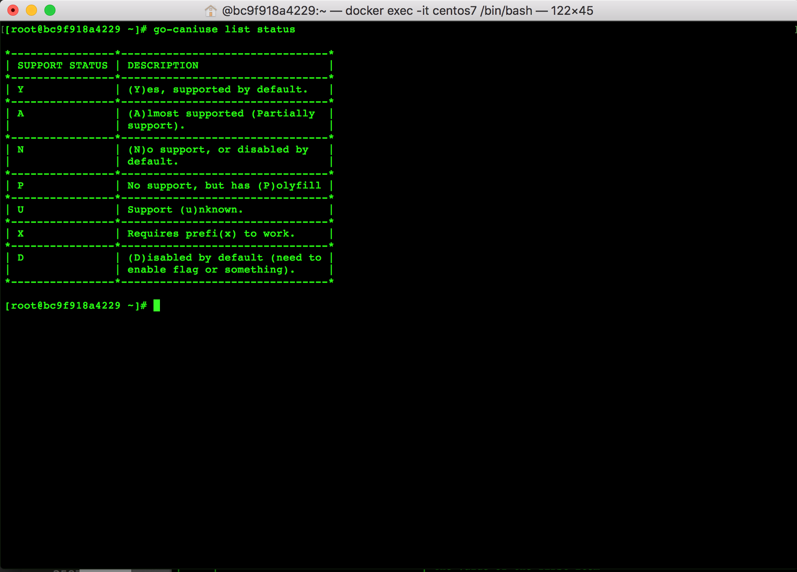

# go-caniuse

A simple command line tool for [caniuse](https://caniuse.com) .




# Usage

For the first time, data file is automatically downloaded from [github.com/Fyrd/caniuse](https://github.com/Fyrd/caniuse)    
But you can download and update data file explicitly.

```
$ go-caniuse update
```

Basic usage.

```
$ go-caniuse websockets
```

<details>
<summary>Result</summary>

```
*------------------*---------*--------------------*---------*----------------------*---*---*---*---*
| NAME             | ID      | Y                  | A       | N                    | P | X | D | U |
*------------------*---------*--------------------*---------*----------------------*---*---*---*---*
| IE               | ie      |                    |         | 5.5~9                |   |   |   |   |
*------------------*---------*--------------------*---------*----------------------*---*---*---*---*
| Edge             | edge    | 12~18              |         |                      |   |   |   |   |
*                  *         *--------------------*---------*----------------------*---*---*---*---*
|                  |         | 75                 |         |                      |   |   |   |   |
*------------------*---------*--------------------*---------*----------------------*---*---*---*---*
| Firefox          | firefox | 11~69              | 4~10    | 2~3.5999999046325684 |   |   |   |   |
*------------------*---------*--------------------*---------*----------------------*---*---*---*---*
| Chrome           | chrome  | 16~78              | 4~15    |                      |   |   |   |   |
*------------------*---------*--------------------*---------*----------------------*---*---*---*---*
| Safari           | safari  | 7                  | 5       | 3.1                  |   |   |   |   |
*                  *         *--------------------*---------*----------------------*---*---*---*---*
|                  |         | 7.1                | 5.1     | 3.2                  |   |   |   |   |
*                  *         *--------------------*---------*----------------------*---*---*---*---*
|                  |         | 8                  | 6       | 4                    |   |   |   |   |
*                  *         *--------------------*---------*----------------------*---*---*---*---*
|                  |         | 9                  | 6.1     |                      |   |   |   |   |
*                  *         *--------------------*---------*----------------------*---*---*---*---*
|                  |         | 9.1                |         |                      |   |   |   |   |
*                  *         *--------------------*---------*----------------------*---*---*---*---*
|                  |         | 10                 |         |                      |   |   |   |   |
*                  *         *--------------------*---------*----------------------*---*---*---*---*
|                  |         | 10.1               |         |                      |   |   |   |   |
*                  *         *--------------------*---------*----------------------*---*---*---*---*
|                  |         | 11                 |         |                      |   |   |   |   |
*                  *         *--------------------*---------*----------------------*---*---*---*---*
|                  |         | 11.1               |         |                      |   |   |   |   |
*                  *         *--------------------*---------*----------------------*---*---*---*---*
|                  |         | 12                 |         |                      |   |   |   |   |
*                  *         *--------------------*---------*----------------------*---*---*---*---*
|                  |         | 12.1               |         |                      |   |   |   |   |
*                  *         *--------------------*---------*----------------------*---*---*---*---*
|                  |         | 13                 |         |                      |   |   |   |   |
*                  *         *--------------------*---------*----------------------*---*---*---*---*
|                  |         | TP                 |         |                      |   |   |   |   |
*------------------*---------*--------------------*---------*----------------------*---*---*---*---*
| Opera            | opera   | 12.100000381469727 | 11~12   | 9                    |   |   |   |   |
*                  *         *--------------------*---------*----------------------*---*---*---*---*
|                  |         | 15~58              |         | 9.5-9.6              |   |   |   |   |
*                  *         *--------------------*---------*----------------------*---*---*---*---*
|                  |         |                    |         | 10.0-10.1            |   |   |   |   |
*                  *         *--------------------*---------*----------------------*---*---*---*---*
|                  |         |                    |         | 10.5                 |   |   |   |   |
*                  *         *--------------------*---------*----------------------*---*---*---*---*
|                  |         |                    |         | 10.6                 |   |   |   |   |
*------------------*---------*--------------------*---------*----------------------*---*---*---*---*
| iOS Safari       | ios_saf | 6.0-6.1            | 4.2-4.3 | 3.2                  |   |   |   |   |
*                  *         *--------------------*---------*----------------------*---*---*---*---*
|                  |         | 7.0-7.1            | 5.0-5.1 | 4.0-4.1              |   |   |   |   |
*                  *         *--------------------*---------*----------------------*---*---*---*---*
|                  |         | 8                  |         |                      |   |   |   |   |
*                  *         *--------------------*---------*----------------------*---*---*---*---*
|                  |         | 8.1-8.4            |         |                      |   |   |   |   |
*                  *         *--------------------*---------*----------------------*---*---*---*---*
|                  |         | 9.0-9.2            |         |                      |   |   |   |   |
*                  *         *--------------------*---------*----------------------*---*---*---*---*
|                  |         | 9.3                |         |                      |   |   |   |   |
*                  *         *--------------------*---------*----------------------*---*---*---*---*
|                  |         | 10.0-10.2          |         |                      |   |   |   |   |
*                  *         *--------------------*---------*----------------------*---*---*---*---*
|                  |         | 10.3               |         |                      |   |   |   |   |
*                  *         *--------------------*---------*----------------------*---*---*---*---*
|                  |         | 11.0-11.2          |         |                      |   |   |   |   |
*                  *         *--------------------*---------*----------------------*---*---*---*---*
|                  |         | 11.3-11.4          |         |                      |   |   |   |   |
*                  *         *--------------------*---------*----------------------*---*---*---*---*
|                  |         | 12.0-12.1          |         |                      |   |   |   |   |
*                  *         *--------------------*---------*----------------------*---*---*---*---*
|                  |         | 12.2               |         |                      |   |   |   |   |
*                  *         *--------------------*---------*----------------------*---*---*---*---*
|                  |         | 13                 |         |                      |   |   |   |   |
*------------------*---------*--------------------*---------*----------------------*---*---*---*---*
| Android Browser  | android | 4.4                |         | 2.1                  |   |   |   |   |
*                  *         *--------------------*---------*----------------------*---*---*---*---*
|                  |         | 4.4.3-4.4.4        |         | 2.2                  |   |   |   |   |
*                  *         *--------------------*---------*----------------------*---*---*---*---*
|                  |         | 67                 |         | 2.3                  |   |   |   |   |
*                  *         *--------------------*---------*----------------------*---*---*---*---*
|                  |         |                    |         | 3                    |   |   |   |   |
*                  *         *--------------------*---------*----------------------*---*---*---*---*
|                  |         |                    |         | 4                    |   |   |   |   |
*                  *         *--------------------*---------*----------------------*---*---*---*---*
|                  |         |                    |         | 4.1                  |   |   |   |   |
*                  *         *--------------------*---------*----------------------*---*---*---*---*
|                  |         |                    |         | 4.2-4.3              |   |   |   |   |
*------------------*---------*--------------------*---------*----------------------*---*---*---*---*
| Opera Mobile     | op_mob  |                    | 11~12   |                      |   |   |   |   |
*------------------*---------*--------------------*---------*----------------------*---*---*---*---*
| Samsung Internet | samsung | 4                  |         |                      |   |   |   |   |
*                  *         *--------------------*---------*----------------------*---*---*---*---*
|                  |         | 5.0-5.4            |         |                      |   |   |   |   |
*                  *         *--------------------*---------*----------------------*---*---*---*---*
|                  |         | 6.2-6.4            |         |                      |   |   |   |   |
*                  *         *--------------------*---------*----------------------*---*---*---*---*
|                  |         | 7.2-7.4            |         |                      |   |   |   |   |
*                  *         *--------------------*---------*----------------------*---*---*---*---*
|                  |         | 8.2                |         |                      |   |   |   |   |
*                  *         *--------------------*---------*----------------------*---*---*---*---*
|                  |         | 9.2                |         |                      |   |   |   |   |
*------------------*---------*--------------------*---------*----------------------*---*---*---*---*


INFO :
  If you don't know much about status(= Y,A,N,P,X,D,U), try below command.
    $ go-caniuse list status
```

</details><br>

Filtering browser by `b` flag.

```
$ go-caniuse -b firefox websockets
```

<details>
<summary>Result</summary>

```
*---------*---------*-------*------*----------------------*---*---*---*---*
| NAME    | ID      | Y     | A    | N                    | P | X | D | U |
*---------*---------*-------*------*----------------------*---*---*---*---*
| Firefox | firefox | 11~69 | 4~10 | 2~3.5999999046325684 |   |   |   |   |
*---------*---------*-------*------*----------------------*---*---*---*---*


INFO :
  If you don't know much about status(= Y,A,N,P,X,D,U), try below command.
    $ go-caniuse list status
```

</details><br>

Display all browsers.

```
$ go-caniuse list browser
```

<details>
<summary>Result</summary>

```

*----*------------------------*---------*
| NO | BROWSER                | ID      |
*----*------------------------*---------*
| 1  | IE                     | ie      |
*----*------------------------*---------*
| 2  | Edge                   | edge    |
*----*------------------------*---------*
| 3  | Firefox                | firefox |
*----*------------------------*---------*
| 4  | Chrome                 | chrome  |
*----*------------------------*---------*
| 5  | Safari                 | safari  |
*----*------------------------*---------*
| 6  | Opera                  | opera   |
*----*------------------------*---------*
| 7  | iOS Safari             | ios_saf |
*----*------------------------*---------*
| 8  | Opera Mini             | op_mini |
*----*------------------------*---------*
| 9  | Android Browser        | android |
*----*------------------------*---------*
| 10 | Blackberry Browser     | bb      |
*----*------------------------*---------*
| 11 | Opera Mobile           | op_mob  |
*----*------------------------*---------*
| 12 | Chrome for Android     | and_chr |
*----*------------------------*---------*
| 13 | Firefox for Android    | and_ff  |
*----*------------------------*---------*
| 14 | IE Mobile              | ie_mob  |
*----*------------------------*---------*
| 15 | UC Browser for Android | and_uc  |
*----*------------------------*---------*
| 16 | Samsung Internet       | samsung |
*----*------------------------*---------*
| 17 | QQ Browser             | and_qq  |
*----*------------------------*---------*
| 18 | Baidu Browser          | baidu   |
*----*------------------------*---------*
| 19 | KaiOS Browser          | kaios   |
*----*------------------------*---------*

```

</details><br>

Display all web technologies.

```
$ go-caniuse list feature
```

<details>
<summary>Result</summary>

```

*-----*---------------------------------*----------------------------------------------------------------*
| NO  | FEATURE                         | DESCRIPTION                                                    |
*-----*---------------------------------*----------------------------------------------------------------*
| 1   | aac                             | Advanced Audio Coding format,                                  |
|     |                                 | designed to be the successor                                   |
|     |                                 | format to MP3, with generally                                  |
|     |                                 | better sound quality.                                          |
*-----*---------------------------------*----------------------------------------------------------------*
| 2   | abortcontroller                 | Controller object that allows                                  |
|     |                                 | you to abort one or more DOM                                   |
|     |                                 | requests made with the Fetch                                   |
|     |                                 | API.                                                           |
*-----*---------------------------------*----------------------------------------------------------------*
| 3   | accelerometer                   | Defines `Accelerometer`,                                       |
|     |                                 | `LinearAccelerationSensor` and                                 |
|     |                                 | `GravitySensor` interfaces for                                 |
|     |                                 | obtaining information about                                    |
|     |                                 | acceleration applied to the X,                                 |
|     |                                 | Y and Z axis of a device that                                  |
|     |                                 | hosts the sensor.                                              |
*-----*---------------------------------*----------------------------------------------------------------*
| 4   | addeventlistener                | The modern standard API for adding DOM event handlers.         |
|     |                                 | Introduced in the DOM Level 2 Events spec. Also                |
|     |                                 | implies support for `removeEventListener`, the [capture        |
|     |                                 | phase](https://dom.spec.whatwg.org/#dom-event-capturing_phase) |
|     |                                 | of DOM event dispatch, as well as the `stopPropagation()` and  |
|     |                                 | `preventDefault()` event methods.                              |
*-----*---------------------------------*----------------------------------------------------------------*
| 5   | ambient-light                   | Defines a concrete sensor                                      |
|     |                                 | interface to monitor the                                       |
|     |                                 | ambient light level or                                         |
|     |                                 | illuminance of the device’s                                    |
|     |                                 | environment.                                                   |
*-----*---------------------------------*----------------------------------------------------------------*
| 6   | apng                            | Like animated GIFs, but                                        |
|     |                                 | allowing 24-bit colors and                                     |
|     |                                 | alpha transparency                                             |
*-----*---------------------------------*----------------------------------------------------------------*
| 7   | array-find                      | The `find()` method returns                                    |
|     |                                 | the value of the first item                                    |
|     |                                 | in the array based on the                                      |
|     |                                 | result of the provided testing                                 |
|     |                                 | function.                                                      |
*-----*---------------------------------*----------------------------------------------------------------*
| 8   | array-flat                      | Methods to flatten any                                         |
|     |                                 | sub-arrays found in an                                         |
|     |                                 | array by concatenating their                                   |
|     |                                 | elements.                                                      |
*-----*---------------------------------*----------------------------------------------------------------*
| 9   | array-includes                  | Determines whether or not                                      |
|     |                                 | an array includes the given                                    |
|     |                                 | value, returning a boolean                                     |
|     |                                 | value (unlike `indexOf`).                                      |
*-----*---------------------------------*----------------------------------------------------------------*
| 10  | arrow-functions                 | Function shorthand using `=>`                                  |
|     |                                 | syntax and lexical `this`                                      |
|     |                                 | binding.                                                       |
*-----*---------------------------------*----------------------------------------------------------------*
| 11  | asmjs                           | An extraordinarily                                             |
|     |                                 | optimizable, low-level subset                                  |
|     |                                 | of JavaScript, intended to                                     |
|     |                                 | be a compile target from                                       |
|     |                                 | languages like C++.                                            |
*-----*---------------------------------*----------------------------------------------------------------*
...
...

```

</details><br>

Please check what support status flags meaning.

```
$ go-caniuse list status
```

<details>
<summary>Result</summary>

```

*----------------*--------------------------------*
| SUPPORT STATUS | DESCRIPTION                    |
*----------------*--------------------------------*
| Y              | (Y)es, supported by default.   |
*----------------*--------------------------------*
| A              | (A)lmost supported (Partially  |
|                | support).                      |
*----------------*--------------------------------*
| N              | (N)o support, or disabled by   |
|                | default.                       |
*----------------*--------------------------------*
| P              | No support, but has (P)olyfill |
*----------------*--------------------------------*
| U              | Support (u)nknown.             |
*----------------*--------------------------------*
| X              | Requires prefi(x) to work.     |
*----------------*--------------------------------*
| D              | (D)isabled by default (need to |
|                | enable flag or something).     |
*----------------*--------------------------------*

```

</details><br>

# Installation

## MacOSX / Homebrew

You can use homebrew.

```
$ brew tap stqp/homebrew-go-caniuse
$ brew install go-caniuse
```

## Binary (including Windows)

Get latest release from [this page](https://github.com/stqp/go-caniuse/releases).
Unpack it somewhere, and add the path of the binary to the $PATH environment. 

## Go user

If you installed golang, you can install by using `go get`.

```
$ go get github.com/stqp/go-caniuse
```

# License

MIT

# Author

Sosuke Tokuda (stqp)
